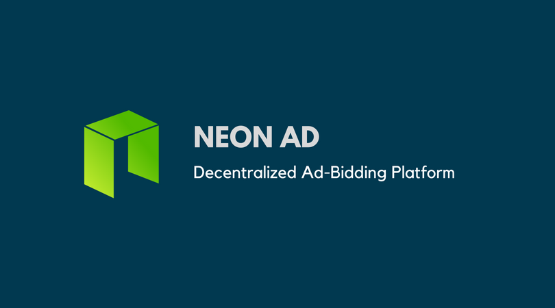

# Neon AD
> A decentralized advertisement Bidding Platform, built on NEO Blockchain

## Motivation
Today, Google Adsense dominate the online commercial market, and it causes some problems. For example, the whole process is not transparent, so there's no way to know if Adsense actually provides number of imporessions they claim.

With Adsense, almost all the advertisement are auto-generated based on Adsense's algorithm, it's customized, but also makes it impossible to **buy out** a specific ad board for a period of time (like what we did with phisical advertisement or TV commercials). This kind of `Ad Bidding` can also be beneficial for website owners, if they feel like their contents can attract more **rich** people who is willing to pay, instead of millions of regular users, they can ask for more from ad providers, and get paid not based on # of view or clicks anymore.

With **Neon Ad**, we provided a totally transparent and fair bidding platform built on NEO Blockchain. Web owners can put their ad boards on the marketplace and ad providers can find their ideal place to show their arts.

We will integrate this feature to `nOS virtual browser`, which is a NEO-backend browser, so we won't need a relay server to connect to the blockchain for you.

### NAD Tokens
* **Token Name**: NeonAD
* **Token Symbol**: NAD
* **Token Standard**: NEP5
* **Total Supply**: 10,000,000
* **Decimals**: 8

### Roadmap
* Main contract
* nOS Interface
  - Also a relay server for non-blockchain browsers

### Functions
Please see the code for argument details

#### Contract Owner Functions
* `deploy`
* `setDefaultContent`

#### Board Owner Functions
* `createBoard`
* `editPeriod`
* `deleteBoard`

#### Login User Functions
* `bidForBoard`
* `editContent`
* `mintTokens` (attach with NEO)

#### Public Methods
* `getBoardList`
* `getContent`

### Contract Hash:
Will be provided here when we publish our first release on Testnet.

## nOS Dapp
I'm also building a nOS Dapp Interface for **NeonAD**, you can visit this link to take a look:

https://github.com/antoncoding/nOS-dapp

### Issue Report or Contribution
Just open an `issue` submit a `pull request`. Any advice or suggestion is welcomed.
I'm looking for partners as well, if you're interested in this project, you can always contact me through email address provided in my profile.
